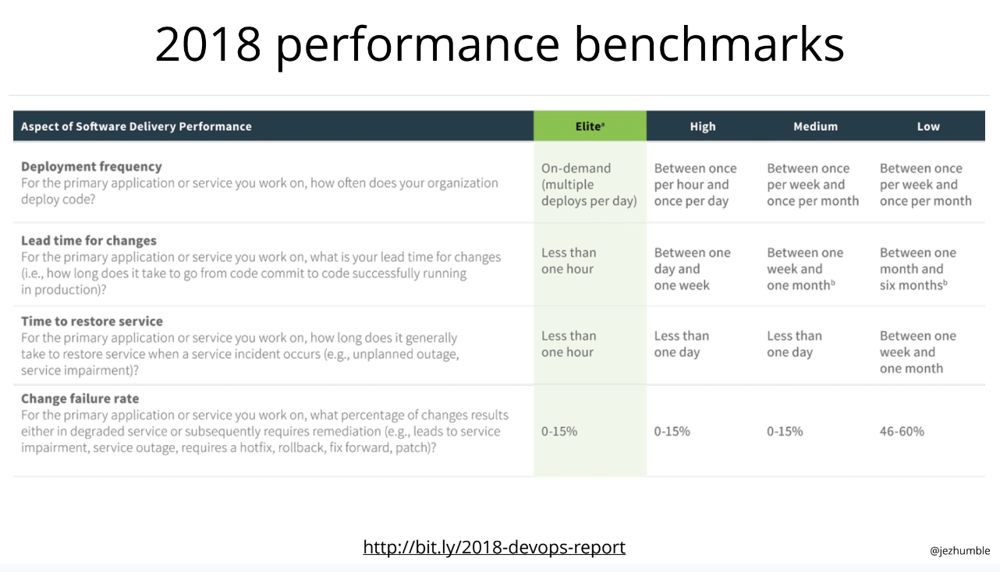

### Movio Support Guild

---

### Agenda
- Homework recap
- Homework presentation
- Poke holes...
- Support metrics.
- Metric workshop ( if we have time )

---

### Last months Homework?
1. Gather your teams ‘Key Components’ and associated repos / technologies from a customer centric perspective.
2. Give your Key Components a ‘confidence rating’ based on the monitoring, testing, ‘code health’ perspective.
3. Publish them.

---

### Homework Presentation
#### Cinema
- Yellow [high-risk](https://github.com/movio/yellow/blob/master/doc/high-risk-areas.md), [releasing](https://github.com/movio/yellow/blob/master/doc/releasing-dangerous-features.md)
- Green [code-health](https://moviohq.atlassian.net/wiki/spaces/GS/pages/433553508/Green+Squad+Code+Health)
- Red [Features](https://github.com/movio/red/blob/master/FEATURES.md), [Process](https://github.com/movio/red/blob/master/PROCESS.md)
- Blue [Confidence Matrix](https://github.com/movio/blue/blob/master/BLUE.md)
@snap[text-center]
##### Media
@snapend
- Shark [Developer-sla](https://moviohq.atlassian.net/wiki/spaces/MM/pages/307298422/Shark+Developer+SLA+s)
- Bear [confidence-homework](https://docs.google.com/spreadsheets/d/127yso8-2srwaR-0Uhs5HeKHgz0IcmaKbyXDmeHPsij4/)

---

### Support metrics
[support-report](https://docs.google.com/spreadsheets/d/1EMX_5PX7mt7d4haAGPAwMkgdH19oAF_09KnDY_thAtM/edit?ouid=106724872082672275169&usp=sheets_home&ths=true)

---

### Metrics workshop

---

### Speed Metrics 
#### <em>Lets work on Speed for the next 3 months</em>
 
- Time to restore service
- Change failure rate

---

---